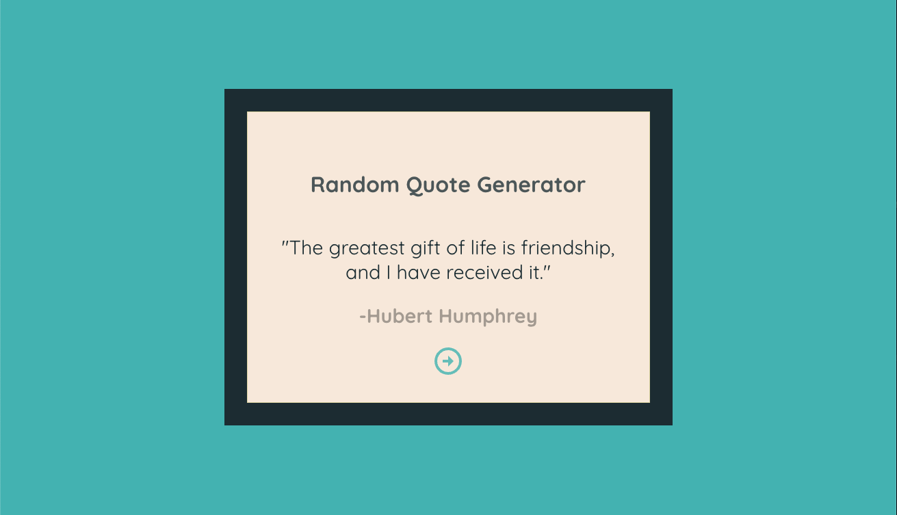
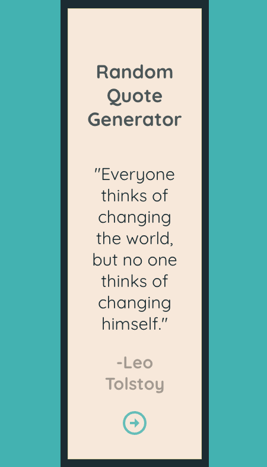

# Random Quote Generator

Who doesn't love a good quote right? Here's an app so you can scroll through some at your leisure.

**Link to project: [Live-demo]https://jscorz-luxur.netlify.app**

|          Desktop           |              Mobile              |
| :------------------------: | :------------------------------: |
|  |  |

---

## **How It's Made:**

This project was a fairly simple build process. First thing was connecting to the API that supplies the quotes for consumption. After that displayed data correctly, I used the useState hook to control the current quote and to switch to a new one when the button is pressed. I used styled components to write the CSS to style the application. Then just added minor animations for the next button.

---

## **Tech used:**

HTML, CSS, Javascript, React JS, Styled components

---

## **Lesson's learned:**

I already knew how to do everything I could learn out of the app, but just wanted a quote generator and something to practice interacting with API's some more.
